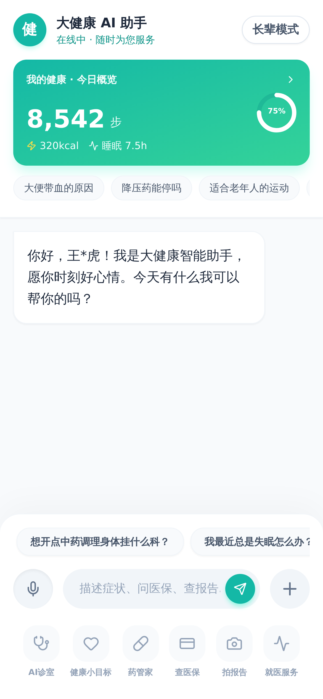
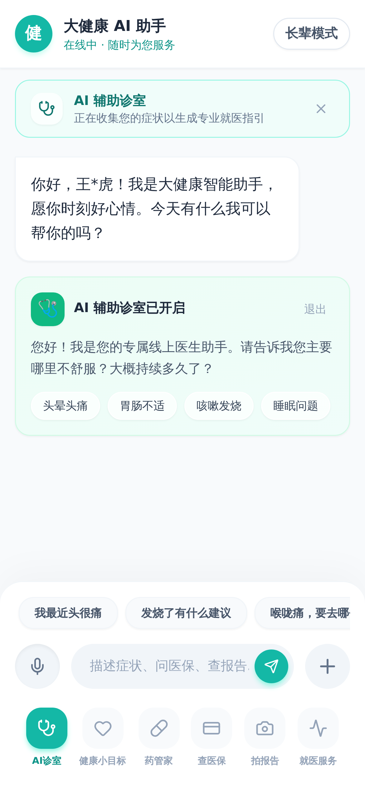
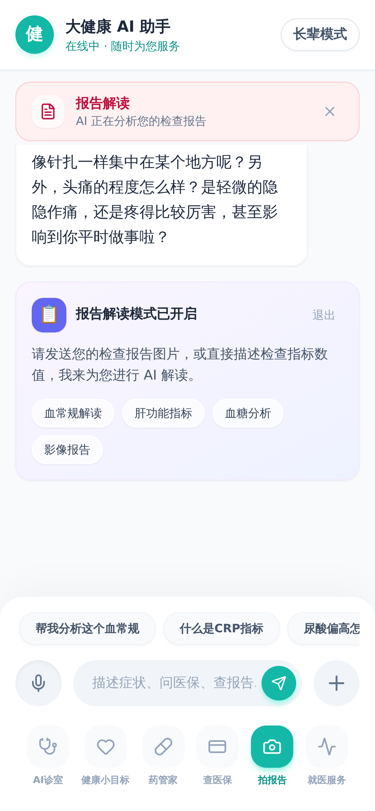
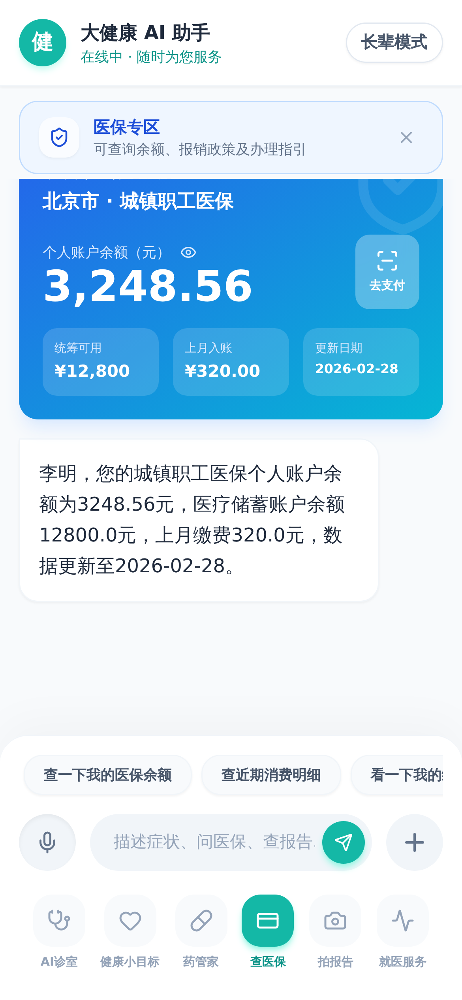
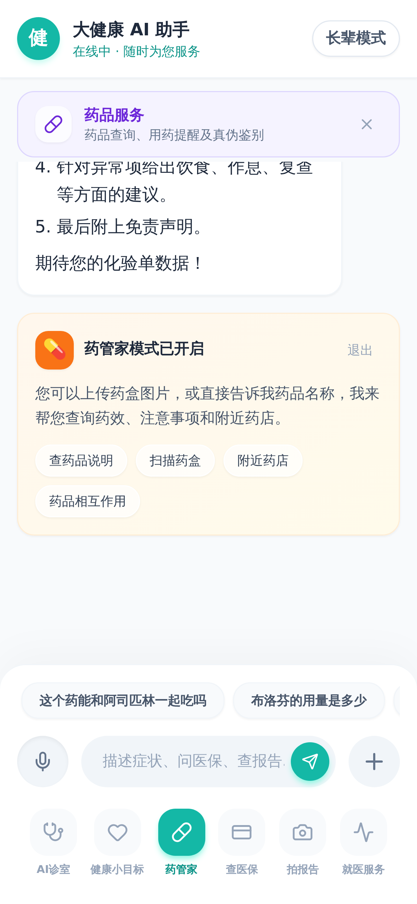
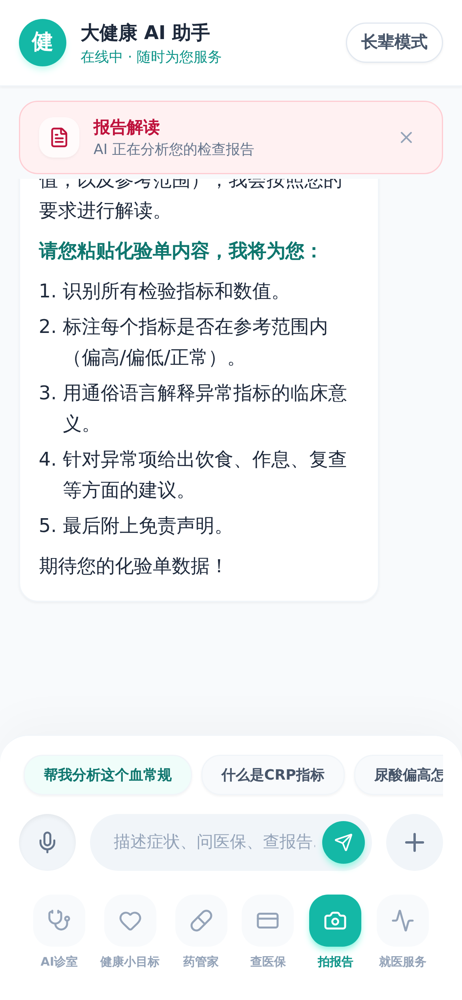
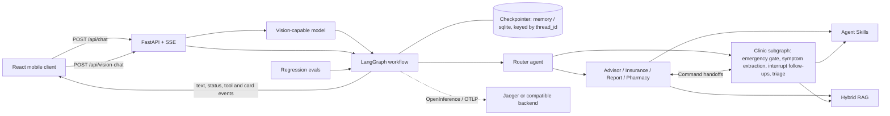

# Smart Health Assistant

[](https://github.com/wananing/Smart-Health-Assistant/releases/latest)
[](backend/pyproject.toml)
[](frontend/package.json)
[](LICENSE)

**English** | [简体中文](README.md)

Smart Health Assistant is a privacy-aware, mobile-first reference application for building multimodal health AI experiences. Inspired by products such as Ant Afu, it combines LangGraph orchestration, a FastAPI streaming backend, and a React client with structured, server-driven UI cards.

The project demonstrates multi-agent routing, hybrid RAG, pluggable Agent Skills, direct vision-model input for medical reports and medicine packaging, OpenTelemetry tracing, and regression evaluation.

> [!IMPORTANT]
> This repository is a technical reference, not a medical device. It must not be used for diagnosis, treatment decisions, emergencies, or medication changes without review by a qualified healthcare professional.

## Screenshots

The interface is designed for mobile viewports. The current product copy and bundled knowledge base are Chinese-first.

<table>
  <tr>
    <td align="center"><br><strong>General assistant</strong></td>
    <td align="center"><br><strong>AI pre-consultation</strong></td>
    <td align="center"><br><strong>Report interpretation</strong></td>
  </tr>
  <tr>
    <td align="center"><br><strong>Insurance services</strong></td>
    <td align="center"><br><strong>Medication assistant</strong></td>
    <td align="center"><br><strong>Structured analysis</strong></td>
  </tr>
</table>

## What It Includes

- **Multi-agent orchestration:** a global router dispatches requests to advisor, clinic, insurance, report, and pharmacy agents while preserving the active specialist context. Specialists can hand a turn to each other with LangGraph `Command` (swarm-style handoff), so a symptom described in insurance mode is answered by the clinic agent in the same turn.
- **Stateful sessions and a real clinic state machine:** the graph is compiled with a checkpointer (memory or SQLite) keyed by `thread_id`. The clinic agent is a compiled subgraph with a code-level emergency gate that runs before any model call, structured symptom extraction, `interrupt()`-based follow-up questions, and a structured triage card. See [`docs/langgraph-runtime.md`](docs/langgraph-runtime.md).
- **Multimodal health workflows:** report, medicine-box, and trace-code images are sent directly to a configured vision-capable model; no separate OCR service is required.
- **Privacy-aware image handling:** report previews are blurred by default, press-and-hold reveal is temporary, and common identity fields are redacted from model output on a best-effort basis.
- **Streaming, server-driven UI:** FastAPI emits text, node status, tool status, and structured card events over SSE; React renders cards in the conversation context.
- **Hybrid RAG:** BM25 and dense retrieval are combined with reciprocal rank fusion. Embedding and vector-store backends are configurable.
- **Pluggable Agent Skills:** domain tools are discovered from `backend/skills/<skill_name>/` without a central registration list.
- **Open observability and evals:** OpenInference spans are exported through OpenTelemetry to Jaeger or another OTLP backend. Anonymous regression cases support strict local scoring and optional DeepEval.
- **Accessible mobile UI:** an elder-friendly mode provides larger text, higher contrast, and simplified interactions.

## Architecture



The backend keeps recognition and reasoning separate: a vision model extracts visible facts, then the report or pharmacy agent interprets the redacted result. The frontend never receives a private chain of thought; it displays execution status and tool-call progress only.

Every SSE stream starts with a `session` event carrying the server-side `thread_id`; clients that echo it back send only the newest message on later turns. UI cards are emitted by the agent that produced the data through LangGraph's custom stream, so the API layer holds no tool-name to card-type mapping. The full rendered graph, including the clinic subgraph and handoff edges, is in [`docs/images/graph.mmd`](docs/images/graph.mmd); release notes are in [`CHANGELOG.md`](CHANGELOG.md).

## Tech Stack

| Layer | Technologies |
| --- | --- |
| Agent runtime | LangGraph, LangChain, OpenAI-compatible model APIs |
| API | Python 3.13, FastAPI, Uvicorn, SSE |
| Frontend | React 19, TypeScript, Vite, Tailwind CSS |
| Retrieval | BM25, dense embeddings, reciprocal rank fusion |
| Vector stores | Chroma, FAISS, Qdrant, pgvector |
| Observability | OpenInference, OpenTelemetry, Jaeger, optional LangSmith |
| Evaluation | Repository-managed JSONL cases, local scoring, optional DeepEval |

## Quick Start

### Prerequisites

- Python `3.13`
- [`uv`](https://docs.astral.sh/uv/)
- Node.js `20.19+` or `22.12+`
- An API key for a supported chat model
- Docker with Compose, only if you want local Jaeger tracing

### 1. Clone and configure the backend

```bash
git clone https://github.com/wananing/Smart-Health-Assistant.git
cd Smart-Health-Assistant/backend

uv sync
cp .env.example .env
```

Edit `backend/.env`. ARK is the backward-compatible default:

```dotenv
LLM_PROVIDER=ark
ARK_API_KEY=your_api_key
ARK_MODEL_ID=your_model_or_endpoint_id
```

Build the local RAG index. The default Hugging Face embedding model is downloaded on first use.

```bash
uv run python -m rag.ingest
uv run uvicorn main:app --reload --port 8000
```

The API is available at `http://localhost:8000`; health checks use `GET /health`.

### 2. Start the frontend

In a second terminal:

```bash
cd Smart-Health-Assistant/frontend
npm ci
npm run dev
```

Open `http://localhost:5173`. Use a mobile browser viewport for the intended layout.

## Model Configuration

All chat integrations use OpenAI-compatible APIs behind one configuration layer.

| Provider | `LLM_PROVIDER` | Main environment variables |
| --- | --- | --- |
| Volcengine ARK / Doubao | `ark` | `ARK_API_KEY`, `ARK_MODEL_ID` |
| OpenAI | `openai` | `OPENAI_API_KEY`, `OPENAI_MODEL` |
| DeepSeek | `deepseek` | `DEEPSEEK_API_KEY`, `DEEPSEEK_MODEL` |
| Alibaba Cloud Model Studio / Qwen | `qwen` | `DASHSCOPE_API_KEY`, `QWEN_MODEL` |
| Zhipu / GLM | `zhipu` | `ZAI_API_KEY`, `ZHIPU_MODEL` |
| Any compatible endpoint | `custom` | `LLM_API_KEY`, `LLM_MODEL`, `LLM_BASE_URL` |

Vision inherits the chat provider by default. If the selected chat model cannot accept images, configure a separate provider and vision-capable model:

```dotenv
VISION_PROVIDER=custom
VISION_API_KEY=your_api_key
VISION_MODEL=your_vision_model
VISION_BASE_URL=https://provider.example.com/v1
```

See [`backend/.env.example`](backend/.env.example) for all provider, embedding, vector-store, tracing, and evaluation options.

## RAG and Agent Skills

The default RAG setup uses a local Hugging Face embedding model and Chroma. Add Markdown sources under `backend/rag/documents/`, then rebuild the index:

```bash
cd backend
uv run python -m rag.ingest --rebuild
```

To add a skill, create `backend/skills/<skill_name>/` with:

```text
SKILL.md       # metadata, usage guidance, and tags
skill.py       # BaseSkill implementation with Pydantic input/output
__init__.py
```

The registry discovers valid skills at startup and assigns them to agents by tag. Detailed design notes are available in [`docs/rag.md`](docs/rag.md) and [`docs/skills.md`](docs/skills.md).

## Observability and Evaluation

Start the bundled in-memory Jaeger instance:

```bash
docker compose -f compose.observability.yml up -d
```

Enable OTLP export in `backend/.env`:

```dotenv
OBSERVABILITY_PROVIDER=otel
OTEL_SERVICE_NAME=smart-health-assistant
OTEL_EXPORTER_OTLP_TRACES_ENDPOINT=http://localhost:4318/v1/traces
TRACE_CONTENT=false
TRACE_IMAGES=false
```

Jaeger is available at `http://localhost:16686`. Medical text and images are excluded from traces by default.

Run the repository-managed regression cases from `backend/`:

```bash
# Strict route and tool-set scoring
uv run python -m evals
uv run python -m evals --case route-report-lab

# Optional DeepEval scoring
uv run --extra eval python -m evals --provider deepeval
```

Evaluation invokes the configured model and may incur provider charges. See [`docs/observability-evals.md`](docs/observability-evals.md) for trace masking, LangSmith compatibility, dataset format, and lifecycle guidance.

## Project Layout

```text
backend/
  agents/          LangGraph router, specialist agents, clinic subgraph, handoffs
  evals/           Regression cases and scoring adapters
  rag/             Retrieval, ingestion, and knowledge documents
  skills/          Auto-discovered domain skills
  main.py          FastAPI and SSE endpoints
  observability.py OpenTelemetry and LangSmith setup
frontend/src/
  components/      Reusable UI and structured chat cards
  screens/         Mobile application views
  services/        SSE and vision API clients
  store/           Shared client state
  types/           Frontend event and card contracts
docs/              Design notes and screenshots
compose.observability.yml
```

## Development Checks

Run deterministic backend tests:

```bash
cd backend
uv run python -m unittest \
  test_llm.py \
  test_vision.py \
  test_main_config.py \
  test_observability.py \
  test_evals.py \
  test_clinic_graph.py \
  test_graph_build.py \
  test_handoff.py \
  test_cards.py
uv lock --check
```

Lint and build the frontend:

```bash
cd frontend
npm run lint
npm run build
```

With both development servers running, execute the Playwright smoke flow with `node test_pw.cjs` from `frontend/`.

## Privacy, Security, and Limitations

- Uploaded images are sent to the configured third-party model provider. Review that provider's data handling terms before using sensitive material.
- UI blur protects against casual on-screen exposure; it does not anonymize the original image sent to the model.
- PII filtering is best effort and is not a substitute for access control, encryption, retention policies, consent, or compliance review.
- Only JPEG, PNG, and WebP uploads up to 8 MB are accepted.
- Bundled insurance services and user records are mock data. The application does not include production authentication, tenancy, billing, or clinical governance.
- Drug trace-code recognition extracts visible content only and does not verify authenticity against a regulatory database.
- Use synthetic or de-identified data for development, testing, screenshots, traces, and evaluation cases.

## Contributing

Issues and focused pull requests are welcome. Describe the behavior change, include verification commands, and attach screenshots for mobile UI changes. New agent behavior should include deterministic tests and at least one normal-path and one safety-boundary evaluation case.

See [`AGENTS.md`](AGENTS.md) for repository conventions and contributor commands.

## License

This project is available under the [MIT License](LICENSE).
