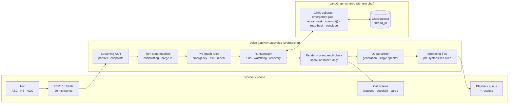
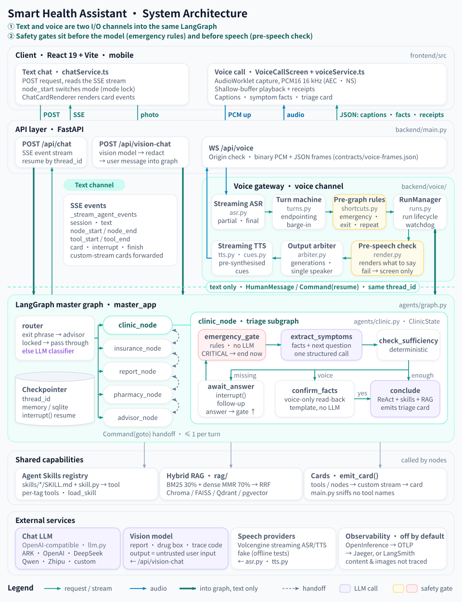

# Smart Health Assistant

[](https://github.com/wananing/Smart-Health-Assistant/releases/latest)
[](backend/pyproject.toml)
[](frontend/package.json)
[](LICENSE)

**English** | [简体中文](README.md)

Smart Health Assistant is a privacy-aware, mobile-first reference application for building multimodal health AI experiences — including a **realtime voice agent**. Inspired by products such as Ant Afu, it combines LangGraph orchestration, a FastAPI streaming backend, and a React client with structured, server-driven UI cards.

The project demonstrates multi-agent routing, a phone-call style **realtime voice consultation** (open mic, barge-in, live captions), hybrid RAG, pluggable Agent Skills, direct vision-model input for medical reports and medicine packaging, OpenTelemetry tracing, and regression evaluation.

> **New: realtime voice consultation.** Tap the 📞 next to the input and describe your symptoms as if calling a doctor: no push-to-talk, interrupt the assistant at any time, and watch captions, the symptom checklist and the triage card update on screen. Streaming ASR → LangGraph → streaming TTS, with every sentence checked against emergency rules before it is spoken. [Jump to the voice section ↓](#voice)

> [!IMPORTANT]
> This repository is a technical reference, not a medical device. It must not be used for diagnosis, treatment decisions, emergencies, or medication changes without review by a qualified healthcare professional.

## Screenshots

The interface is designed for mobile viewports. The current product copy and bundled knowledge base are Chinese-first.

<table>
  <tr>
    <td align="center"><br><strong>Home: health summary + chat</strong></td>
    <td align="center"><br><strong>AI clinic: triage card</strong></td>
    <td align="center"><br><strong>Insurance credential and balance</strong></td>
  </tr>
  <tr>
    <td align="center"><br><strong>Insurance expenses</strong></td>
    <td align="center"><br><strong>Lab report, item by item</strong></td>
    <td align="center"><br><strong>Medicine information</strong></td>
  </tr>
  <tr>
    <td align="center"><br><strong>Nearby pharmacies</strong></td>
    <td align="center"><br><strong>Daily health goals</strong></td>
    <td align="center"><br><strong>Elder mode</strong></td>
  </tr>
</table>

All data in the screenshots is synthetic.

<a id="voice"></a>

## Realtime Voice Consultation

A phone-call style triage conversation. Speak naturally and pause when you are done — no button to hold. Interrupt the assistant whenever you like. It asks follow-up questions, reads the key facts back for confirmation, and gives a triage recommendation while the screen shows captions, the symptom checklist and the result card. When you hang up, the transcript and a consultation summary card land in the chat, and you can continue by text.

<table>
  <tr>
    <td align="center"><br><strong>Open mic + live captions</strong></td>
    <td align="center"><br><strong>Thinking (running node shown)</strong></td>
    <td align="center"><br><strong>Read-back, tap to correct</strong></td>
  </tr>
  <tr>
    <td align="center"><br><strong>First sentence spoken, card follows</strong></td>
    <td align="center"><br><strong>Emergency takeover (uninterruptible)</strong></td>
    <td align="center"><br><strong>Summary card after hang-up</strong></td>
  </tr>
</table>

### What "full duplex" means here

**The interaction is full duplex:** audio flows both ways for the whole call; you can start talking at any moment and the assistant stops within a few hundred milliseconds and listens. No push-to-talk, no waiting for it to finish.

**The implementation is a cascade** (streaming ASR → LangGraph → streaming TTS) with barge-in arbitration, not an end-to-end full-duplex speech model. That is a deliberate choice for healthcare: an end-to-end model speaks while it thinks, so there is no complete text to check before it is heard. In the cascade, **every sentence exists as complete text before it is spoken**, so it can pass emergency rules and wording and disclaimer checks, and it reuses the very same LangGraph clinic subgraph and evals as the text chat.

### Capabilities

| Capability | How |
| --- | --- |
| Open mic + barge-in | Server-side endpointing (streaming ASR endpoint + adaptive wait); speech while the assistant talks stops playback; stale audio is discarded by turn generation; the client sends playback receipts |
| Text before voice | Everything spoken is written first and passes a pre-speech check (wording, number reading, disclaimer) before TTS; if it fails, it only goes to the screen |
| Emergency safety | Every utterance goes through the rule-based emergency gate before the graph; a hit cuts playback, plays an **uninterruptible** safety line and takes over the screen with a call-120 button |
| Read-back confirmation | Key facts are read back from a template (no model), confirmed by voice or edited on screen |
| First sentence first | The conclusion's first sentence is spoken as soon as it is complete while the body streams to the screen |
| Reconnect recovery | A dropped connection does not cancel the graph run; its result lands in the checkpoint and a reconnect on the same `thread_id` carries on |
| Elder mode | Longer endpointing wait, an always-visible "done" button, slower speech, large captions; falls back to manual turn commit when recognition struggles |
| Privacy | Raw audio is never stored or logged; ASR results are redacted before entering the graph; transcripts stay out of traces |
| Wire contract | `contracts/voice-frames.json` defines every frame; backend and frontend tests both validate against it, so a one-sided protocol change fails a test |

### Architecture


```mermaid
flowchart LR
    subgraph App["Browser / phone"]
        Mic["Mic<br/>AEC · NS · AGC"] --> Up["PCM16 16 kHz<br/>20 ms frames"]
        Play["Playback queue<br/>+ receipts"]
        UI["Call screen<br/>captions · checklist · cards"]
    end
    subgraph GW["Voice gateway /api/voice (WebSocket)"]
        ASR["Streaming ASR<br/>partials · endpoints"] --> Turn["Turn state machine<br/>endpointing · barge-in"]
        Turn --> Rules["Pre-graph rules<br/>emergency · exit · repeat"]
        Rules --> Run["RunManager<br/>runs · watchdog · recovery"]
        Run --> Render["Render + pre-speech check<br/>speak or screen-only"]
        Render --> Arb["Output arbiter<br/>generation · single speaker"]
        Arb --> TTS["Streaming TTS<br/>pre-synthesised cues"]
    end
    subgraph G["LangGraph (shared with text chat)"]
        Clinic["Clinic subgraph<br/>emergency gate · extract+ask · interrupt() · read-back · conclude"]
        CP[("Checkpointer<br/>thread_id")]
    end
    Up --> ASR
    Run <--> Clinic
    Clinic <--> CP
    TTS --> Play
    Render --> UI
```

Only text crosses between the gateway and the graph: to LangGraph, the voice gateway is just another `/api/chat` caller (same `thread_id`, `Command(resume=…)` for pending questions), so none of the medical logic is rewritten for voice.

### Measured latency

Live services (Volcengine streaming ASR `bigmodel_async` + `seed-tts-1.0`, chat model `doubao-seed-2-0-lite` with thinking off), driven by synthetic speech with `test_voice_live.py e2e`:

| Stage | Measured |
| --- | --- |
| End of speech → turn committed | 0.2–0.3 s |
| TTS first audio | 0.3–0.5 s |
| Follow-up question spoken (after commit) | ~2.6–3.0 s |
| Read-back spoken | ~2.5–3.5 s |
| Conclusion starts speaking (after confirm) | ~5.8–7.0 s |
| Triage card on screen (after confirm) | ~12.5–14 s |

The bottleneck is model time-to-first-token (1.3–1.7 s measured) and the serial calls of the conclusion turn; see the measurements section of [`docs/voice-clinic.md`](docs/voice-clinic.md).

### Known limitations

- **Echo cancellation on real phones is not yet verified.** All tests above used synthetic audio. Whether the browser's AEC removes the assistant's own voice on a phone speaker decides how well open-mic barge-in works; try it with headphones first. When the client reports no AEC, the gateway falls back to half duplex (tap to interrupt).
- **Voice covers the AI clinic only.** Insurance, pharmacy and report specialists are text-only; the 📞 button appears on the home chat and in the clinic.
- **Speech providers:** Volcengine is verified live; a `fake` provider supports offline development and tests; an Alibaba Cloud Model Studio adapter is not implemented yet.

The full design (turn model, barge-in, read-back, emergency handling, client protocol, privacy, evaluation) is in [`docs/voice-clinic.md`](docs/voice-clinic.md) (Chinese).

## What It Includes

- **Realtime voice agent:** open-mic, interruptible phone-call style consultation over WebSocket with streaming ASR/TTS, sharing the clinic subgraph and server-side session with the text chat. See [above](#voice).
- **Multi-agent orchestration:** a global router dispatches requests to advisor, clinic, insurance, report, and pharmacy agents while preserving the active specialist context. Specialists can hand a turn to each other with LangGraph `Command` (swarm-style handoff), so a symptom described in insurance mode is answered by the clinic agent in the same turn.
- **Stateful sessions and a real clinic state machine:** the graph is compiled with a checkpointer (memory or SQLite) keyed by `thread_id`. The clinic agent is a compiled subgraph with a code-level emergency gate that runs before any model call and again on every follow-up answer, one structured call that extracts symptoms and drafts the next question, `interrupt()`-based follow-up questions, and a structured triage card. See [`docs/langgraph-runtime.md`](docs/langgraph-runtime.md).
- **Multimodal health workflows:** report, medicine-box, and trace-code images are sent directly to a configured vision-capable model; no separate OCR service is required.
- **Privacy-aware image handling:** report previews are blurred by default, press-and-hold reveal is temporary, and common identity fields are redacted from model output on a best-effort basis.
- **Streaming, server-driven UI:** FastAPI emits text, node status, tool status, and structured card events over SSE; React renders cards in the conversation context.
- **Hybrid RAG:** BM25 and dense retrieval are combined with reciprocal rank fusion. Embedding and vector-store backends are configurable.
- **Pluggable Agent Skills:** domain tools are discovered from `backend/skills/<skill_name>/` without a central registration list.
- **Open observability and evals:** OpenInference spans are exported through OpenTelemetry to Jaeger or another OTLP backend. Anonymous regression cases support strict local scoring and optional DeepEval.
- **Design system and elder mode:** semantic colour, type, radius and shadow tokens with shared result-card components ([`frontend/docs/design-system.md`](frontend/docs/design-system.md)); elder mode moves every text role one size up and adds a large voice-consultation entry.

## Architecture

<p align="center"></p>

The backend keeps recognition and reasoning separate: a vision model extracts visible facts, then the report or pharmacy agent interprets the redacted result. The frontend never receives a private chain of thought; it displays execution status and tool-call progress only.

Every SSE stream starts with a `session` event carrying the server-side `thread_id`; clients that echo it back send only the newest message on later turns. UI cards are emitted by the agent that produced the data through LangGraph's custom stream, so the API layer holds no tool-name to card-type mapping. The full rendered graph, including the clinic subgraph and handoff edges, is in [`docs/images/graph.mmd`](docs/images/graph.mmd); release notes are in [`CHANGELOG.md`](CHANGELOG.md).

## Tech Stack

| Layer | Technologies |
| --- | --- |
| Agent runtime | LangGraph, LangChain, OpenAI-compatible model APIs |
| API | Python 3.13, FastAPI, Uvicorn, SSE, WebSocket |
| Speech | Volcengine streaming ASR + bidirectional TTS (pluggable providers), Web Audio AudioWorklet capture |
| Frontend | React 19, TypeScript, Vite, Tailwind CSS |
| Retrieval | BM25, dense embeddings, reciprocal rank fusion |
| Vector stores | Chroma, FAISS, Qdrant, pgvector |
| Observability | OpenInference, OpenTelemetry, Jaeger, optional LangSmith |
| Evaluation | Repository-managed JSONL cases, local scoring, optional DeepEval |

## Quick Start

### Prerequisites

- Python `3.13`
- [`uv`](https://docs.astral.sh/uv/)
- Node.js `20.19+` or `22.12+`
- An API key for a supported chat model
- Docker with Compose, only if you want local Jaeger tracing

### 1. Clone and configure the backend

```bash
git clone https://github.com/wananing/Smart-Health-Assistant.git
cd Smart-Health-Assistant/backend

uv sync
cp .env.example .env
```

Edit `backend/.env`. ARK is the backward-compatible default:

```dotenv
LLM_PROVIDER=ark
ARK_API_KEY=your_api_key
ARK_MODEL_ID=your_model_or_endpoint_id
```

Build the local RAG index. The default Hugging Face embedding model is downloaded on first use.

```bash
uv run python -m rag.ingest
uv run uvicorn main:app --reload --port 8000
```

The API is available at `http://localhost:8000`; health checks use `GET /health`.

### 2. Start the frontend

In a second terminal:

```bash
cd Smart-Health-Assistant/frontend
npm ci
npm run dev
```

Open `http://localhost:5173`. Use a mobile browser viewport for the intended layout.

### 3. Enable voice consultation (optional)

Configure a speech provider in `backend/.env` and restart the backend; then tap 📞 next to the input:

```dotenv
# Volcengine streaming ASR + bidirectional TTS (one new-console API key, sent as X-Api-Key)
ASR_PROVIDER=volcengine
TTS_PROVIDER=volcengine
VOLC_VOICE_API_KEY=your_voice_api_key
# Optional: ASR_URL (default bigmodel_async, with live captions), TTS_SPEAKER, ASR_END_WINDOW_MS … see .env.example

# No speech account? Offline doubles for UI work:
# ASR_PROVIDER=fake   # hears nothing; use "type" in the call screen
# TTS_PROVIDER=fake   # plays silence
```

- Browsers allow the microphone only on `localhost` or HTTPS; testing on a phone over the LAN needs HTTPS and the page origin in `EXTRA_ALLOWED_ORIGINS`.
- To work on the call screen without a backend, run `node mock_voice_server.cjs` and start the frontend with `VITE_VOICE_WS_URL=ws://localhost:8765/api/voice npm run dev` (both from `frontend/`).
- To place a full call against live services and print stage latencies: `uv run python test_voice_live.py e2e --calls 2` (backend running).

## Model Configuration

All chat integrations use OpenAI-compatible APIs behind one configuration layer.

| Provider | `LLM_PROVIDER` | Main environment variables |
| --- | --- | --- |
| Volcengine ARK / Doubao | `ark` | `ARK_API_KEY`, `ARK_MODEL_ID` |
| OpenAI | `openai` | `OPENAI_API_KEY`, `OPENAI_MODEL` |
| DeepSeek | `deepseek` | `DEEPSEEK_API_KEY`, `DEEPSEEK_MODEL` |
| Alibaba Cloud Model Studio / Qwen | `qwen` | `DASHSCOPE_API_KEY`, `QWEN_MODEL` |
| Zhipu / GLM | `zhipu` | `ZAI_API_KEY`, `ZHIPU_MODEL` |
| Any compatible endpoint | `custom` | `LLM_API_KEY`, `LLM_MODEL`, `LLM_BASE_URL` |

Vision inherits the chat provider by default. If the selected chat model cannot accept images, configure a separate provider and vision-capable model:

```dotenv
VISION_PROVIDER=custom
VISION_API_KEY=your_api_key
VISION_MODEL=your_vision_model
VISION_BASE_URL=https://provider.example.com/v1
```

See [`backend/.env.example`](backend/.env.example) for all provider, embedding, vector-store, tracing, and evaluation options.

## RAG and Agent Skills

The default RAG setup uses a local Hugging Face embedding model and Chroma. Add Markdown sources under `backend/rag/documents/`, then rebuild the index:

```bash
cd backend
uv run python -m rag.ingest --rebuild
```

To add a skill, create `backend/skills/<skill_name>/` with:

```text
SKILL.md       # metadata, usage guidance, and tags
skill.py       # BaseSkill implementation with Pydantic input/output
__init__.py
```

The registry discovers valid skills at startup and assigns them to agents by tag. Detailed design notes are available in [`docs/rag.md`](docs/rag.md) and [`docs/skills.md`](docs/skills.md).

## Observability and Evaluation

Start the bundled in-memory Jaeger instance:

```bash
docker compose -f compose.observability.yml up -d
```

Enable OTLP export in `backend/.env`:

```dotenv
OBSERVABILITY_PROVIDER=otel
OTEL_SERVICE_NAME=smart-health-assistant
OTEL_EXPORTER_OTLP_TRACES_ENDPOINT=http://localhost:4318/v1/traces
TRACE_CONTENT=false
TRACE_IMAGES=false
```

Jaeger is available at `http://localhost:16686`. Medical text and images are excluded from traces by default.

Run the repository-managed regression cases from `backend/`:

```bash
# Strict route and tool-set scoring
uv run python -m evals
uv run python -m evals --case route-report-lab

# Optional DeepEval scoring
uv run --extra eval python -m evals --provider deepeval
```

Evaluation invokes the configured model and may incur provider charges. See [`docs/observability-evals.md`](docs/observability-evals.md) for trace masking, LangSmith compatibility, dataset format, and lifecycle guidance.

## Project Layout

```text
backend/
  agents/          LangGraph router, specialist agents, clinic subgraph, handoffs
  evals/           Regression cases and scoring adapters
  rag/             Retrieval, ingestion, and knowledge documents
  skills/          Auto-discovered domain skills
  voice/           Voice gateway: turns, barge-in, run lifecycle, rendering, ASR/TTS providers
  main.py          FastAPI, SSE and WebSocket endpoints
  observability.py OpenTelemetry and LangSmith setup
frontend/src/
  components/      Reusable UI, structured chat cards, voice call components
  design/          Design tokens and the elder-mode text scale
  screens/         Home chat, health dashboard, voice call screen
  services/        SSE, vision and voice (WebSocket + AudioWorklet) clients
  store/           Shared client state
  types/           Frontend event and card contracts
contracts/         Voice WebSocket wire contract shared by backend and frontend tests
docs/              Design notes and screenshots
compose.observability.yml
```

## Development Checks

Run deterministic backend tests:

```bash
cd backend
uv run python -m unittest \
  test_llm.py \
  test_vision.py \
  test_main_config.py \
  test_observability.py \
  test_evals.py \
  test_clinic_graph.py \
  test_graph_build.py \
  test_handoff.py \
  test_cards.py \
  test_skill_tools.py \
  test_voice_protocol.py \
  test_voice_providers.py \
  test_voice_render.py \
  test_voice_gateway.py \
  test_voice_clinic.py \
  test_voice_volc_protocol.py \
  test_voice_runs.py \
  test_voice_contract.py
uv lock --check
```

Lint and build the frontend:

```bash
cd frontend
npm run lint
npm run build
```

With both development servers running, execute the Playwright smoke flow with `node test_pw.cjs` from `frontend/`. The voice call screen has its own browser test against the mock server: `node test_voice.cjs` (see the file header for setup); it also fails on any frame that breaks the wire contract.

## Privacy, Security, and Limitations

- Voice calls stream microphone audio to the configured speech provider. The app asks for consent before the first call; raw audio is not stored or logged, and transcripts are redacted before reaching the model.
- Uploaded images are sent to the configured third-party model provider. Review that provider's data handling terms before using sensitive material.
- UI blur protects against casual on-screen exposure; it does not anonymize the original image sent to the model.
- PII filtering is best effort and is not a substitute for access control, encryption, retention policies, consent, or compliance review.
- Only JPEG, PNG, and WebP uploads up to 8 MB are accepted.
- Bundled insurance services and user records are mock data. The application does not include production authentication, tenancy, billing, or clinical governance.
- Drug trace-code recognition extracts visible content only and does not verify authenticity against a regulatory database.
- Use synthetic or de-identified data for development, testing, screenshots, traces, and evaluation cases.

## Contributing

Issues and focused pull requests are welcome. Describe the behavior change, include verification commands, and attach screenshots for mobile UI changes. New agent behavior should include deterministic tests and at least one normal-path and one safety-boundary evaluation case.

See [`AGENTS.md`](AGENTS.md) for repository conventions and contributor commands.

## License

This project is available under the [MIT License](LICENSE).
