# 🏥 大健康智能助手 (Smart Health Assistant)

> 🚀 **开源版 医疗/医保 多智能体对话系统** —— 对标国内头部平台（如蚂蚁阿福、支付宝健康管家等）的 AI 健康助手落地架构。

基于 **LangGraph + FastAPI + React** 的生产级 AI 多智能体（Multi-Agent）对话架构。不只是一个聊天机器人，而是深度融合了**流式工具调用**与**结构化 UI 卡片**的下一代智能分发引擎。


## 📸 运行效果预览

这是一个**纯移动端（Mobile-First）**设计的项目，强烈建议使用 Chrome 手机独立模式体验。

<table>
  <tr>
    <td align="center">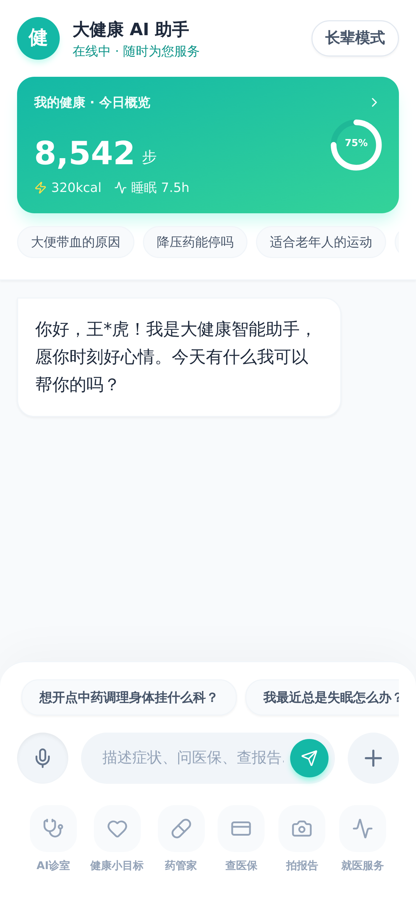<br/><b>1. 通用助手模式</b></td>
    <td align="center">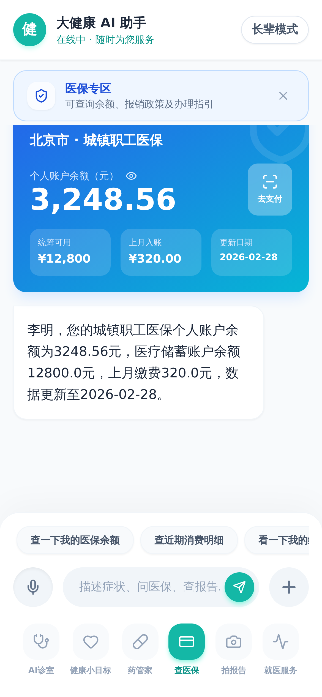<br/><b>2. 医保垂直大厅</b></td>
    <td align="center">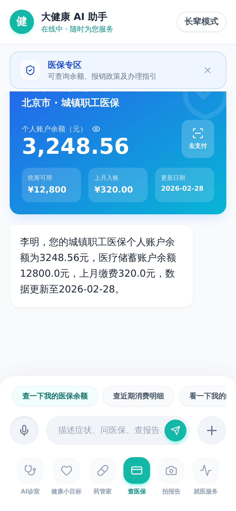<br/><b>3. 动态医保余额卡片</b></td>
  </tr>
  <tr>
    <td align="center">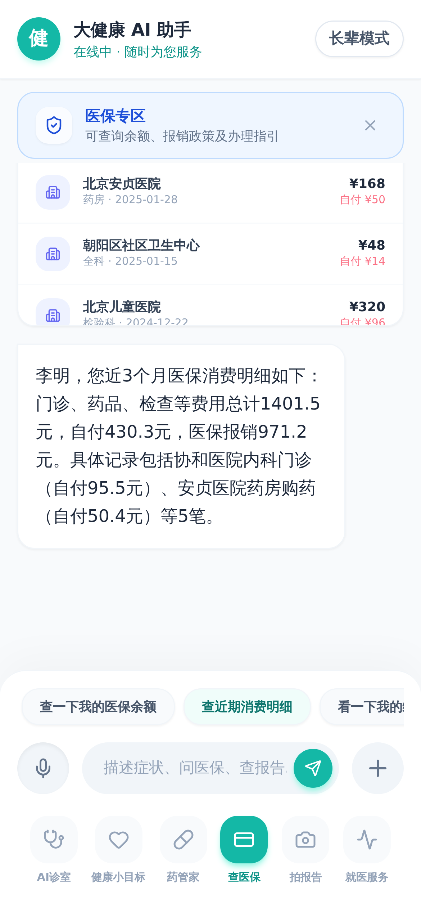<br/><b>4. 近期消费明细报表</b></td>
    <td align="center">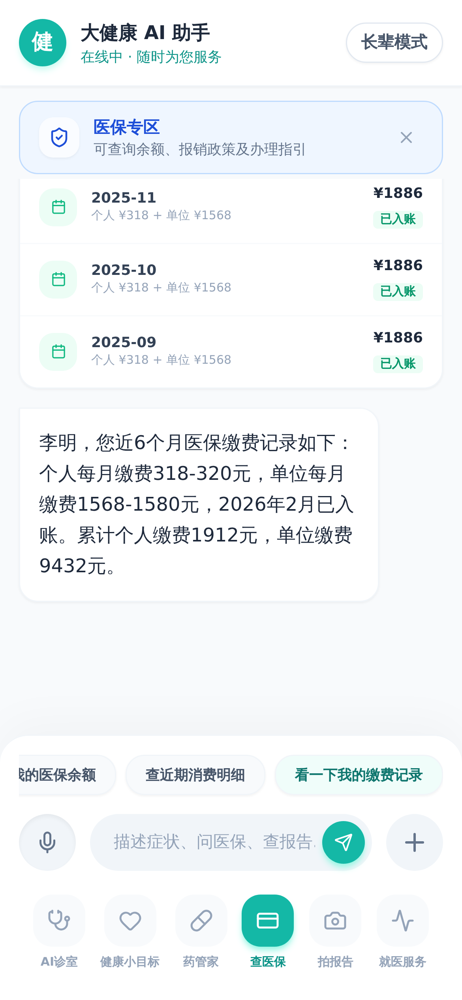<br/><b>5. 月度缴费记录跟踪</b></td>
    <td align="center">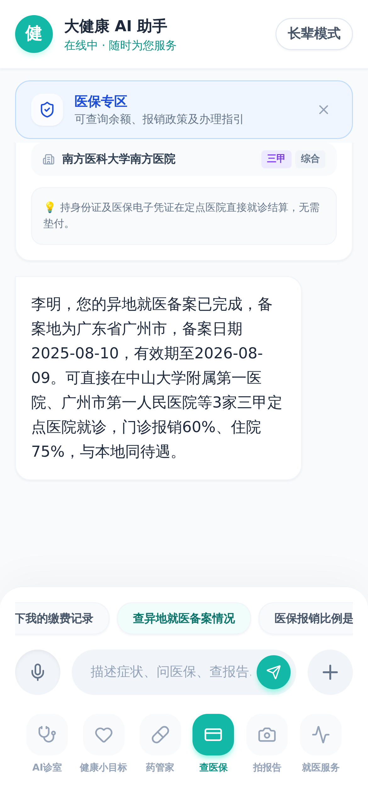<br/><b>6. 异地就医备案卡片</b></td>
  </tr>
  <tr>
    <td align="center">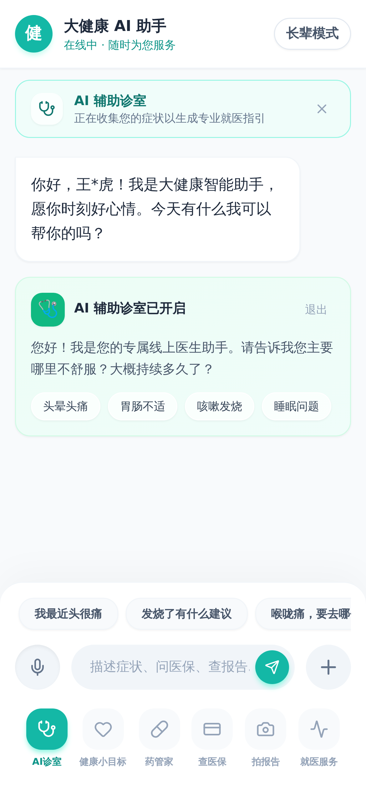<br/><b>7. AI 诊室 (预问诊)</b></td>
    <td align="center">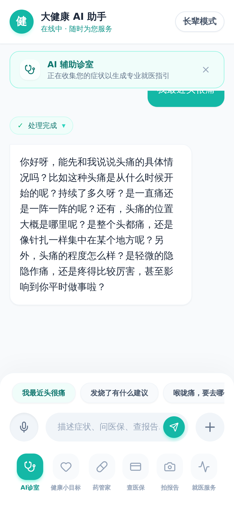<br/><b>8. 医患流式问答</b></td>
    <td align="center">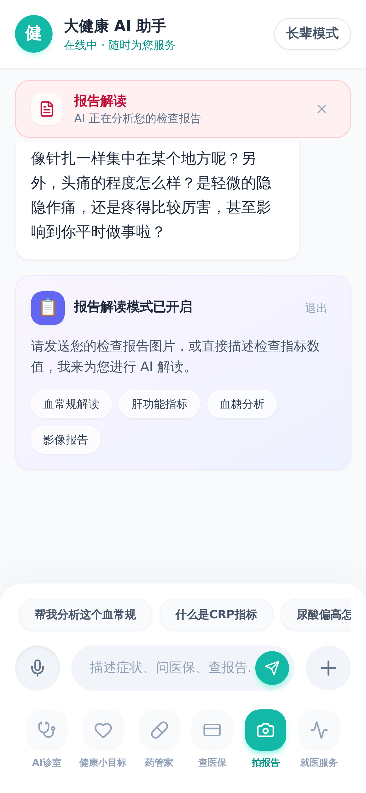<br/><b>9. 拍报告 (报告解读)</b></td>
  </tr>
  <tr>
    <td align="center">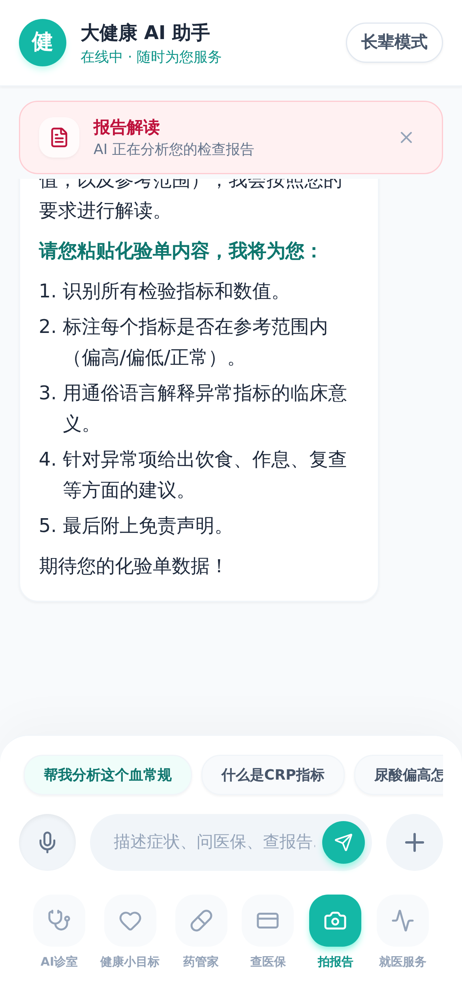<br/><b>10. 化验单指标分析</b></td>
    <td align="center">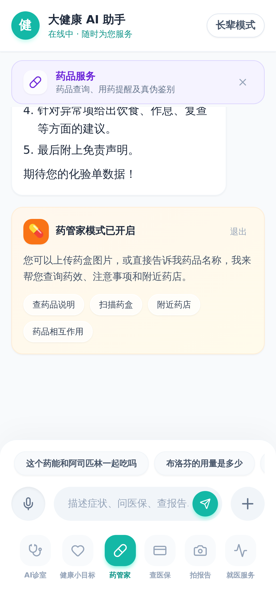<br/><b>11. 药管家大厅</b></td>
    <td align="center">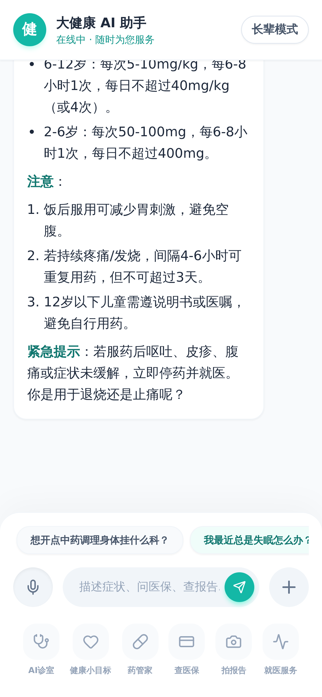<br/><b>12. 药品知识图谱互答</b></td>
  </tr>
</table>

## ✨ 核心特性

- **🧠 多智能体路由 (Multi-Agent Routing)**:
  - 采用总分架构。通过全局 Router Agent 实时进行意图分类，无缝调度至不同的垂直领域专家智能体。
  - **支持预问诊** (Clinic Agent)：多轮追问症状（部位、持续时间、伴随症状等），最终生成带严重等级的就诊科室建议卡片。
  - **支持医保服务** (Insurance Agent)：接入模拟医保接口，查询医保余额、消费明细、缴费记录、异地就医备案，数据通过卡片直出。
  - **支持健康问答** (Advisor Agent)：通用的医学科普与生活建议。
  - *随时可扩展药管家 (Pharmacy) 与报告解读 (Report) Agent。*

- **⚡ 丝滑的 UI 端到端体验 (SSE + Server-Driven UI)**:
  - **后端接管 UI 渲染**：工具调用完成后，后端不仅返回文字总结，还通过 SSE 下发 `{"type": "card", "payload": ...}` 事件。
  - **前端动态呈现**：前端接收到事件后，实时在聊天气泡上下文中渲染出高颜值的定制卡片（如：带渐变背景、防窥探交互的医保卡片）。

- **👵 适老化无障碍设计 (Elder-Friendly Mode)**:
  - 一键切换长辈模式（大字体、高对比度、简化界面操作）。

- **🛠️ 生产级工程规范**:
  - **Backend**: Python、FastAPI、LangChain、LangGraph、Uvicorn，遵循严格的类型提示和清晰的状态流转（State Graph）。
  - **Frontend**: React、TypeScript、TailwindCSS、Vite，针对移动端进行了像素级还原（Mobile-First）。

---

## 🏗️ 系统架构

项目的核心在于 **“状态路由 + 工具卡片双向绑定”**：

1. **Agent State**: `messages`, `active_agent`, `userInfo`。
2. **Router Node**: 识别用户意图，如果已经处于特定 Agent 的会话中，则“锁定”上下文直到用户主动退出（发送“结束/不看了”）。
3. **Event Stream**: 后端使用异步 Generator 透传 LangGraph 的内部运行状态（`node_start`, `tool_start`, `tool_end`, `card`）。前端依据流日志渲染**实时思考链 (Thinking Steps)**。

---

## 🚀 快速开始

本项目分为前端（React + TypeScript）和后端（Python FastAPI）两部分。

### 1. 后端服务 (Backend)

后端以 Python 编写，推荐使用 `uv` 进行环境管理。

```bash
cd backend

# 安装依赖项 (如果没有 uv 可以使用 pip install -r requirements.txt)
uv sync

# 配置环境变量
cp .env.example .env
# 在 .env 中填入你的大模型 API KEY (支持 OpenAI / 星火 / 阿里通义 / 智谱 等兼容格式)

# 启动服务 (运行于 8000 端口)
uv run uvicorn main:app --reload --port 8000
```

### 2. 前端服务 (Frontend)

前端基于 Vite 无打包构建，速度极快。

```bash
cd frontend

# 安装依赖
npm install

# 启动开发服务器 (运行于 5173 端口)
npm run dev
```

启动完成后，在浏览器中访问 http://localhost:5173。切换设备模拟为手机视图（iPhone 13 等）以获得最佳体感。

---

## 🛠 开发与定制

### 如何增加一个新的 Agent？
1. 在 `backend/agents` 目录下新建 `your_agent.py`，并定义包含系统提示词和对应 `tools` 的 `create_react_agent` 实例。
2. 在 `backend/agents/graph.py` 中，定义一个 `your_node` 函数调用你创建的 agent。将它添加进图节点并连接来自路由器的 Edge。
3. 在 `backend/agents/router.py` 的提示词和分类器中，加入对你工具意图的理解定义。

### 如何增加一个前端 UI 卡片？
1. 后端调用工具后，在 `main.py` 的 SSE 拦截层，抓取输出并 yield `{ "type": "card", "payload": { "type": "your_card_type", "data": ... } }`。
2. 前端 `src/types/index.ts` 中增加 `ChatCardPayload` 联合类型。
3. 在 `frontend/src/components/chat/ChatCardRenderer.tsx` 中编写你的 React 视图组件即可。

---

## 📜 规划与 Roadmap

- [x] 多 Agent 路由调度核心 (LangGraph)
- [x] 智能预问诊 & 报告科室推荐
- [x] 基于流式卡片的医保服务面板 (对齐真实业务场景)
- [x] 上下文环境隔离机制 (进入专科诊室 / 退出诊断)
- [ ] 接入多模态：图片问诊（OCR化验单、药盒图片识别）
- [ ] 语音交互接入：实时 ASR 与 TTS（流式语音包反馈）

## 📄 开源协议

本项目采用 **MIT License**。你可以自由使用、修改和分发，但也请在你的项目中保留本项目的署名。

## 💡 鸣谢与灵感

本项目产品交互灵感来源于对**医疗大健康赛道**真实落地诉求的拆解，特别致敬业内优秀产品在“长辈模式”、“卡片富文本协同”领域的探索与实践。期待与开源社区一起，将这一套生产力框架推广到更多垂直泛健康场景。
