[English](README.en.md) | **简体中文**

# 🏥 大健康智能助手 (Smart Health Assistant)

> 🚀 **开源版 医疗/医保 多智能体对话系统 + 实时语音 Agent** —— 对标国内头部平台（如蚂蚁阿福、支付宝健康管家等）的 AI 健康助手落地架构。

基于 **LangGraph + FastAPI + React** 的完整 AI 多智能体全栈参考实现。不只是一个聊天机器人，而是深度融合了**流式工具调用**、**结构化 UI 卡片**与**实时语音通话**的智能分发引擎。

- 🎙️ **新增实时语音问诊（Realtime Voice Agent）**：像打电话一样问诊——开放麦连续对话、助手说话时随时开口打断，屏幕同步显示实时字幕、症状要点和分诊卡片。流式 ASR + LangGraph + 流式 TTS 的级联架构，每一句话出声前都经过急症规则与安全检查。[跳转到语音问诊 ↓](#voice)
- 支持 **服务端会话、预问诊子图与 Agent 转接**：Checkpointer + `thread_id`、代码级急症闸门、`interrupt()` 追问、专科之间的 `Command` handoff。详见 [docs/langgraph-runtime.md](docs/langgraph-runtime.md)
- 支持 **多模态图片识别**：拍照看报告、拍照问药与药品追溯码识别
- 支持 **多模型配置**：聊天模型可切换 ARK、OpenAI、DeepSeek、通义千问、智谱或任意 OpenAI-compatible 服务；图片模型可独立配置
- 支持 **RAG 知识库增强**：常见疾病、医保政策、检验参考范围、药品用药指南。详见 [docs/rag.md](docs/rag.md)
- 支持 **Agent Skills System**：每个智能体可动态加载模块化领域技能。详见 [docs/skills.md](docs/skills.md)
- 支持 **开源可观测与评估**：OpenTelemetry/OpenInference 链路、Jaeger 与 DeepEval 回归评估。详见 [docs/observability-evals.md](docs/observability-evals.md)
- 统一的 **移动端设计规范**：语义色、字号、圆角、阴影全部收敛到设计令牌，长辈模式自动放大。详见 [frontend/docs/design-system.md](frontend/docs/design-system.md)

## 📸 运行效果预览

这是一个 **纯移动端（Mobile-First）** 设计的项目，强烈建议使用 Chrome 手机模拟（iPhone 13 等）体验。截图中的数据均为合成数据。

<table>
  <tr>
    <td align="center">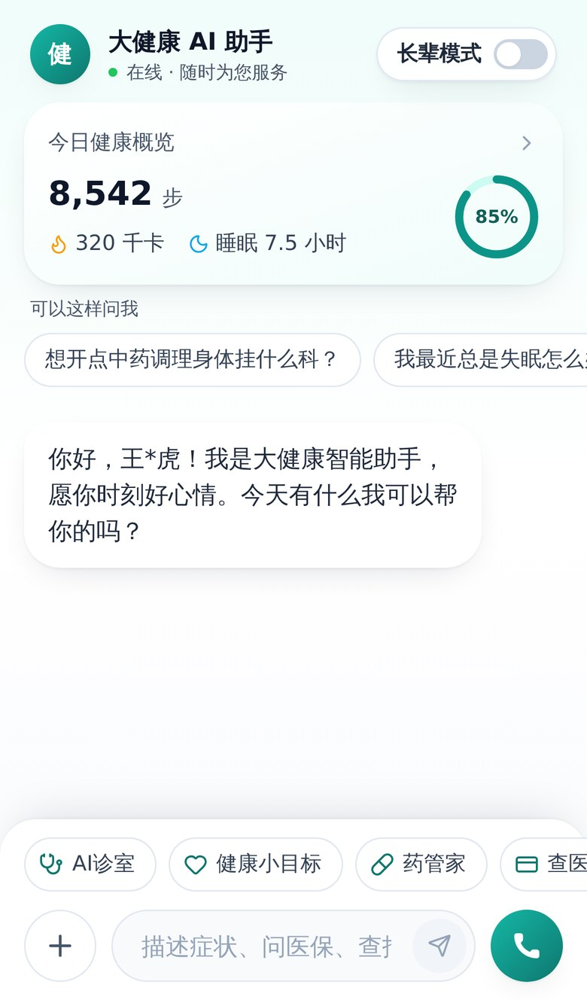<br/><b>1. 首页：健康概览 + 对话</b></td>
    <td align="center">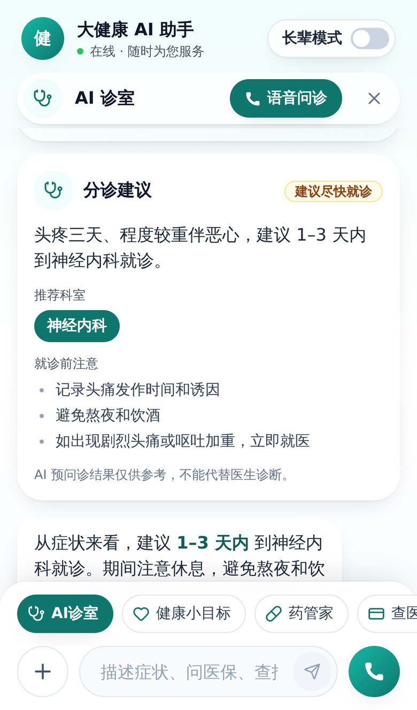<br/><b>2. AI 诊室：分诊建议卡片</b></td>
    <td align="center">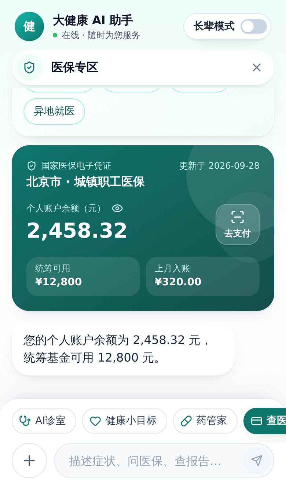<br/><b>3. 医保电子凭证与余额</b></td>
  </tr>
  <tr>
    <td align="center">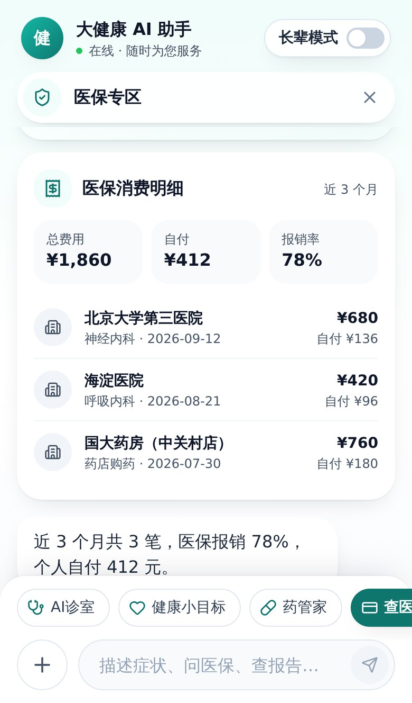<br/><b>4. 医保消费明细</b></td>
    <td align="center">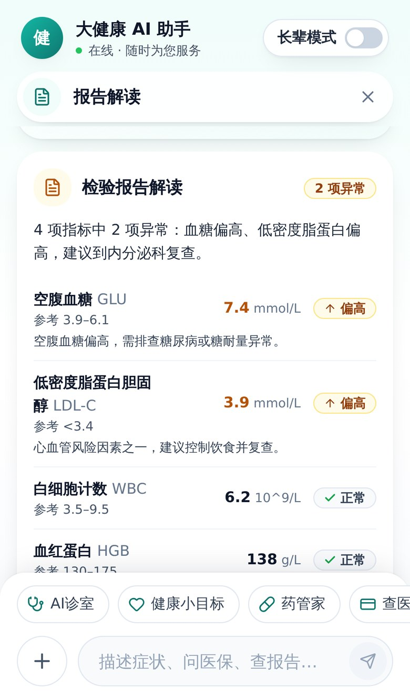<br/><b>5. 检验报告逐项解读</b></td>
    <td align="center">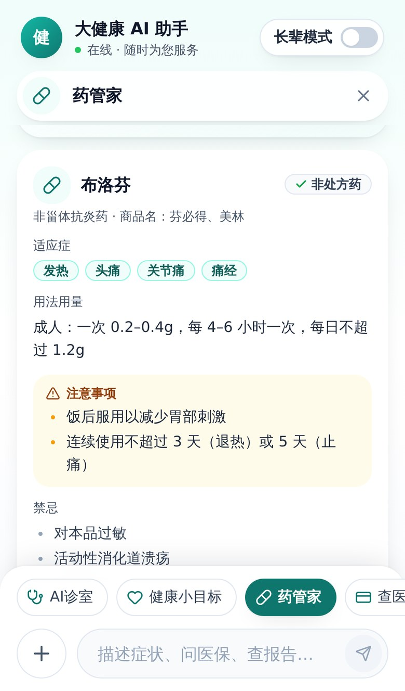<br/><b>6. 药品信息与用药提醒</b></td>
  </tr>
  <tr>
    <td align="center">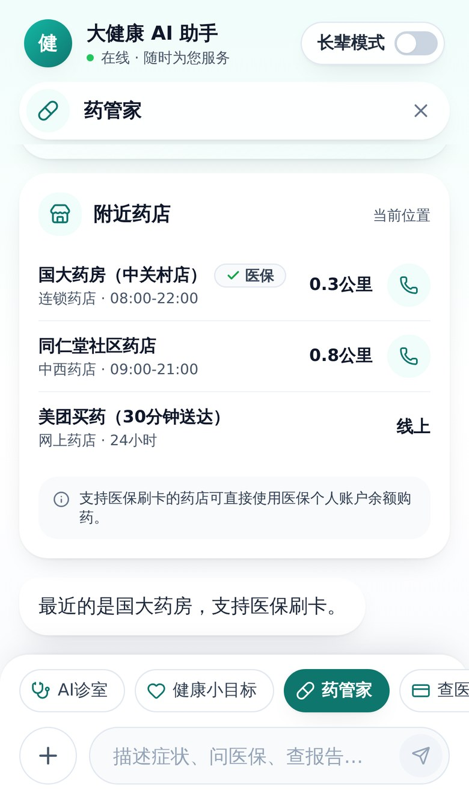<br/><b>7. 附近药店（医保 / 一键拨打）</b></td>
    <td align="center">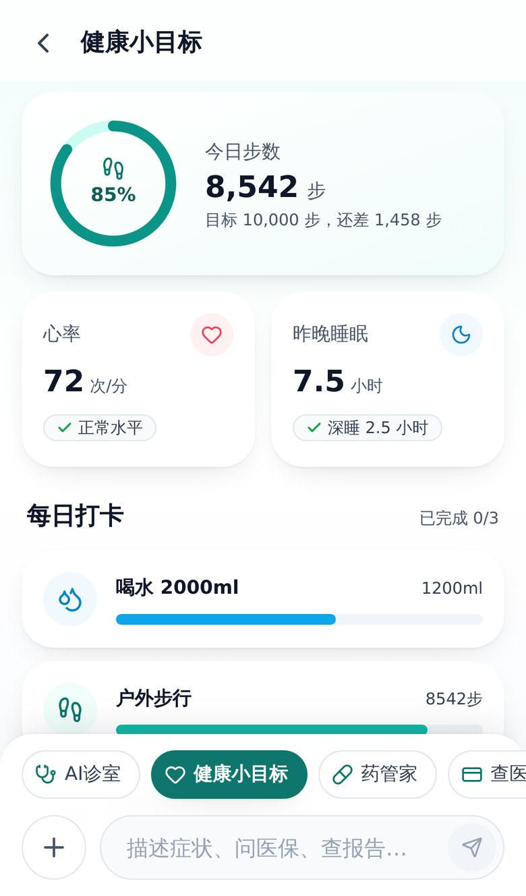<br/><b>8. 健康小目标</b></td>
    <td align="center">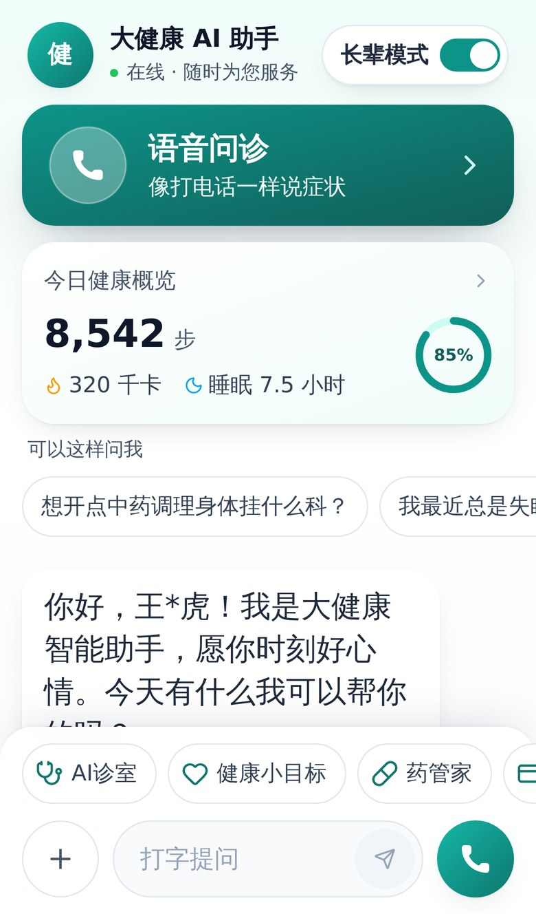<br/><b>9. 长辈模式</b></td>
  </tr>
</table>

---

<a id="voice"></a>

## 🎙️ 实时语音问诊（Realtime Voice Agent）

点输入栏旁的 📞，就能像给医生打电话一样描述症状：不用按住说话，说完自然停顿即可；助手在说话时你可以直接开口打断；助手追问、复述确认、给出分诊建议，屏幕上同步显示字幕、症状要点和结论卡片；挂断后整段通话和一张问诊小结卡写回聊天记录，可以接着用文字问。

<table>
  <tr>
    <td align="center">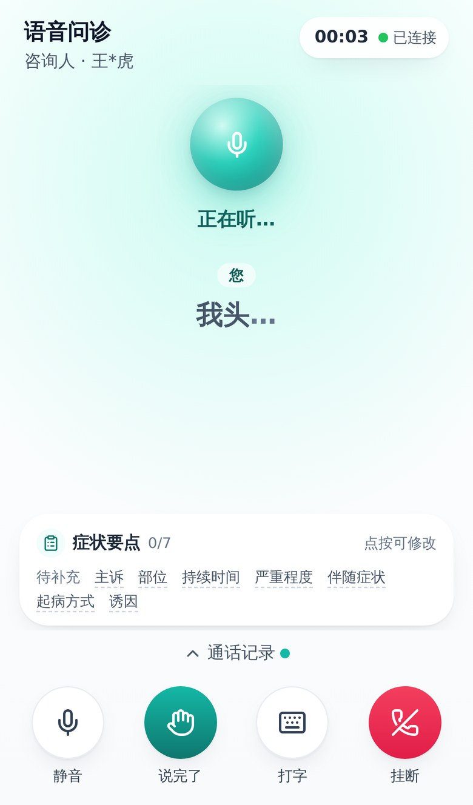<br/><b>开放麦聆听 + 实时字幕</b></td>
    <td align="center">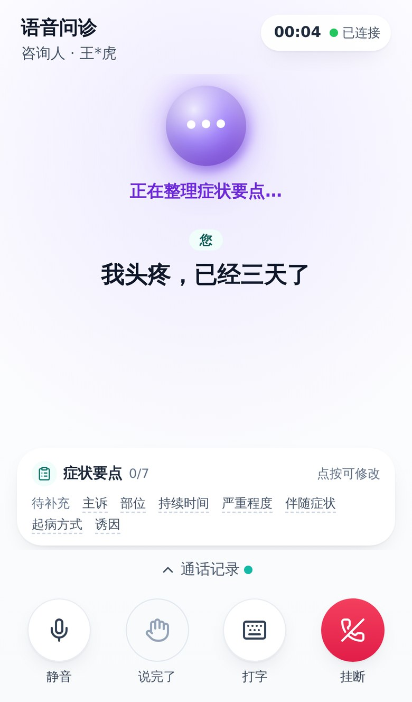<br/><b>思考中（显示正在执行的节点）</b></td>
    <td align="center">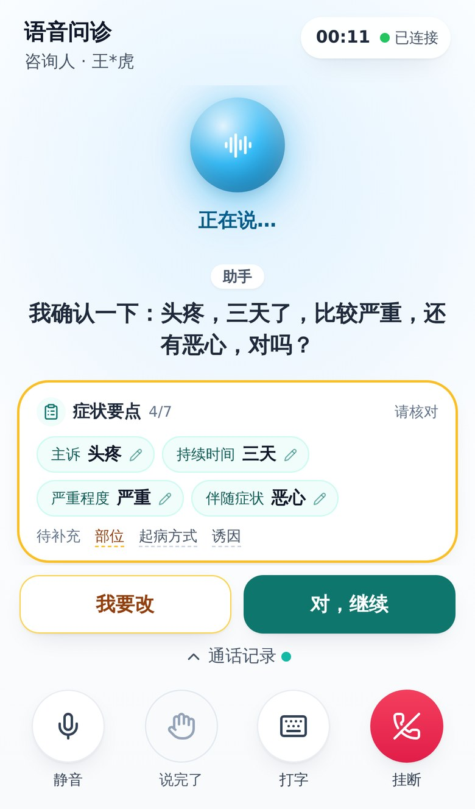<br/><b>关键信息复述确认，可点改</b></td>
  </tr>
  <tr>
    <td align="center">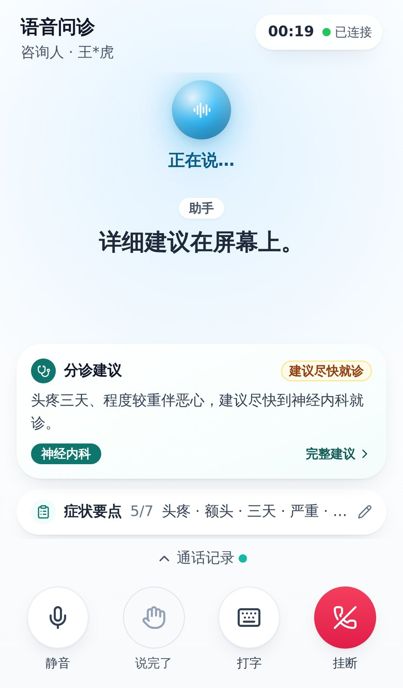<br/><b>结论首句先播，卡片随后上屏</b></td>
    <td align="center">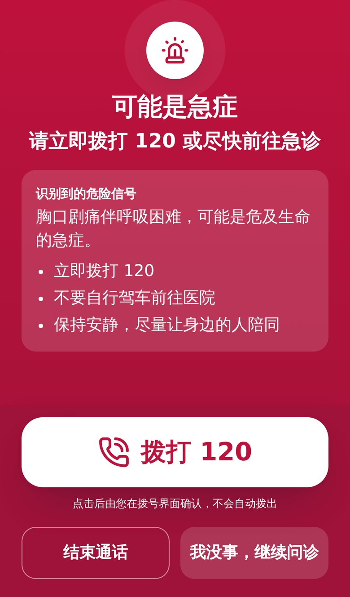<br/><b>急症全屏接管（不可打断）</b></td>
    <td align="center">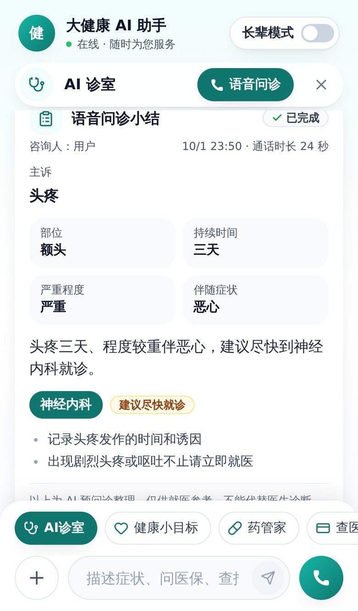<br/><b>挂断后的问诊小结卡</b></td>
  </tr>
</table>

### 它是怎样的"全双工"

**交互上是全双工体验**：上下行音频在整通电话里一直在线，你随时可以开口，助手会在几百毫秒内停下并开始听；不需要按键，也不需要等它说完。

**实现上是级联架构**（流式 ASR → LangGraph → 流式 TTS）加打断仲裁，而不是端到端的全双工语音大模型。这是为医疗场景做的取舍：端到端模型边想边说，出声前没有完整文本可以检查；级联架构让**每一句话在出声前都是完整文本**，可以做急症规则、措辞和免责检查，也能复用文字通道的同一张 LangGraph 预问诊子图、同一套评测。

### 核心能力

| 能力 | 做法 |
| --- | --- |
| 开放麦 + 打断（barge-in） | 服务端判停（流式 ASR 端点 + 自适应等待）；助手说话时检测到有效人声即停播，旧音频按回合代际丢弃，客户端回传播放回执 |
| 文本先于语音 | 所有要念的内容先成文，过出声前检查（措辞、数字读法、免责）再送 TTS；不通过就只上屏 |
| 急症安全 | 每一句话进图之前先过纯规则的急症闸门；命中即打断播报，播放**不可打断**的安全提示，全屏显示拨打 120 |
| 关键信息复述确认 | 症状要点用模板复述（不经模型），用户口头确认或在屏幕上直接改 |
| 首句先播 | 结论回合模型先写一句话结论，切到首个句号就送 TTS，正文继续流式上屏 |
| 断线恢复 | 断线不取消图运行，结果写进 checkpoint；带同一 `thread_id` 重连后接着问 |
| 适老化 | 更长的判停等待、常驻"说完了"按钮、放慢语速、大字幕；识别不顺时自动降级为手动提交 |
| 隐私 | 原始音频不落盘、不进日志；ASR 结果先脱敏再进图；转写不写入 trace |
| 协议契约 | `contracts/voice-frames.json` 定义所有帧，后端测试与前端测试都按它校验，任一方偏离即失败 |

### 架构

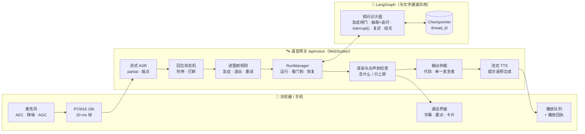
```mermaid
flowchart LR
    subgraph App["📱 浏览器 / 手机"]
        Mic["麦克风<br/>AEC · 降噪 · AGC"] --> Up["PCM16 16k<br/>20 ms 帧"]
        Play["播放队列<br/>+ 播放回执"]
        UI["通话界面<br/>字幕 · 要点 · 卡片"]
    end
    subgraph GW["🛰️ 语音网关 /api/voice（WebSocket）"]
        ASR["流式 ASR<br/>partial · 端点"] --> Turn["回合状态机<br/>判停 · 打断"]
        Turn --> Rules["进图前规则<br/>急症 · 退出 · 重说"]
        Rules --> Run["RunManager<br/>运行 · 看门狗 · 恢复"]
        Run --> Render["渲染与出声前检查<br/>念什么 / 只上屏"]
        Render --> Arb["输出仲裁<br/>代际 · 单一发言者"]
        Arb --> TTS["流式 TTS<br/>提示语预合成"]
    end
    subgraph G["🧠 LangGraph（与文字通道共用）"]
        Clinic["预问诊子图<br/>急症闸门 · 抽取+追问 · interrupt() · 复述 · 结论"]
        CP[("Checkpointer<br/>thread_id")]
    end
    Up --> ASR
    Run <--> Clinic
    Clinic <--> CP
    TTS --> Play
    Render --> UI
```

网关和图之间只传文本：对 LangGraph 来说，语音网关就是另一个 `/api/chat` 调用方（同一个 `thread_id`，挂起时用 `Command(resume=…)` 恢复），医疗逻辑一行都不需要为语音重写。

### 实测延迟

真实服务（火山引擎流式 ASR `bigmodel_async` + `seed-tts-1.0`，对话模型 `doubao-seed-2-0-lite`，关闭思考），用合成语音跑 `test_voice_live.py e2e`：

| 阶段 | 实测 |
| --- | --- |
| 说完到回合提交 | 0.2–0.3 s |
| TTS 首包 | 0.3–0.5 s |
| 追问出声（回合提交后） | 约 2.6–3.0 s |
| 复述确认出声 | 约 2.5–3.5 s |
| 结论语音开口（确认后） | 约 5.8–7.0 s |
| 分诊卡片上屏（确认后） | 约 12.5–14 s |

瓶颈在模型首 token（实测 1.3–1.7 s）和结论回合的串行调用，优化记录和下一步见 [docs/voice-clinic.md](docs/voice-clinic.md) 的“实测记录”一节。

### 已知限制

- **真机回声消除尚未验证**：以上测试都用合成音频完成。手机外放时浏览器 AEC 能否消干净助手自己的声音，决定开放麦打断的效果；建议先戴耳机体验。客户端上报不支持 AEC 时，网关会自动退到半双工（助手说话时只能点屏幕打断）。
- **语音目前只覆盖 AI 诊室**：医保、药房、报告等专科仍走文字；电话按钮只在首页和诊室显示。
- **语音服务商**：已实测火山引擎；`fake` 服务商用于离线开发和测试；阿里云百炼适配器尚未实现。

完整设计（回合模型、打断、复述确认、急症处理、客户端协议、隐私、评测）见 [docs/voice-clinic.md](docs/voice-clinic.md)。

---

## ✨ 核心特性

- **🧠 多智能体路由 (Multi-Agent Routing)**:
  - 采用总分架构。通过全局 Router Agent 实时进行意图分类，无缝调度至不同的垂直领域专家智能体。
  - **支持预问诊** (Clinic Agent)：多轮追问症状（部位、持续时间、伴随症状等），最终生成带紧急程度的就诊科室建议卡片。
  - **支持医保服务** (Insurance Agent)：接入模拟医保接口，查询医保余额、消费明细、缴费记录、异地就医备案，数据通过卡片直出。
  - **支持健康问答** (Advisor Agent)：通用的医学科普与生活建议。
  - **支持药管家与报告解读**：药品信息、相互作用查询、附近药店、拍照问药，以及检查报告图片和检验指标逐项解读。

- **🎙️ 实时语音问诊 (Realtime Voice Agent)**:
  - 开放麦、可打断的通话式问诊，与文字通道共用同一张预问诊子图和同一个服务端会话。详见上方[语音问诊](#voice)。

- **🔁 服务端会话与 Agent 转接 (Checkpointer + Handoff)**:
  - 主图携带 LangGraph Checkpointer（memory / sqlite），会话按 `thread_id` 持久化，前端每轮只发最新一条消息。
  - 预问诊是独立子图：代码级急症闸门先于任何模型调用，并且每次追问的回答都会重新经过闸门；一次结构化调用同时完成症状抽取与追问起草；信息不足时用 `interrupt()` 挂起追问，用户回复后从断点恢复。
  - 专科之间支持 swarm 式转接：在医保模式里描述症状，医保智能体会通过 `transfer_to_clinic` 把这一轮直接交给预问诊，不再需要用户先说“退出”。

- **⚡ 丝滑的 UI 端到端体验 (SSE + Server-Driven UI)**:
  - **后端接管 UI 渲染**：工具调用完成后，后端不仅返回文字总结，还通过 SSE 下发 `{"type": "card", "payload": ...}` 事件。
  - **前端动态呈现**：所有结果卡片基于共享的 `ResultCard` 组件族，异常、待确认、急症用统一的语义色区分。

- **👵 适老化无障碍设计 (Elder-Friendly Mode)**:
  - 一键切换长辈模式：全局字号上移一级，大号语音问诊入口，语音通话放慢语速、延长判停等待。

- **📚 RAG 知识库增强 (Retrieval-Augmented Generation)**:
  - 内置混合检索引擎：**BM25（精确匹配）+ 密集向量（语义检索）**，通过倒数排名融合（RRF）合并结果，精准命中医学术语的同时兼顾语义理解。
  - 覆盖四大领域知识库：**常见疾病（高血压/糖尿病/心脏病）、医保政策（门诊/住院报销/异地就医）、检验参考范围（血常规/生化/尿常规）、药品用药指南（OTC/处方药/药物相互作用）**。
  - **可插拔后端设计**：嵌入模型支持 HuggingFace 本地（`BAAI/bge-small-zh-v1.5`，离线可用）、OpenAI API、字节 ARK API 三选一；向量库支持 Chroma / FAISS / Qdrant / pgvector 按需切换。服务启动时后台预热，首次检索不再等待模型加载。

- **🧩 可插拔技能系统 (Agent Skills System)**:
  - 每个智能体均可动态加载**模块化领域技能**，无需修改 Agent 代码即可扩展能力。
  - 内置 6 项核心技能：急症安全预检（`emergency_triage`）、症状严重度评分（`symptom_scorer`）、健康指标计算（`health_calculator`）、化验单解读（`lab_interpreter`）、慢性病风险评估（`risk_assessor`）、药物剂量计算（`medication_calculator`）。
  - **零配置自发现**：新增技能只需创建子目录 + `SKILL.md` + `skill.py`，工具参数直接取自技能的 `input_schema`；单个技能加载失败只会跳过它本身。

- **🔭 开源可观测与评估 (Observability & Evals)**:
  - 使用 OpenInference 自动采集 LangGraph 节点、文本/视觉模型与工具调用，以标准 OTLP 输出到 Jaeger 或其他 OpenTelemetry 后端。
  - 内置匿名回归样例与严格本地评分，可选 DeepEval；医疗文本和图片默认不进入 Trace，DeepEval 遥测默认关闭。

- **🛠️ 完整全栈工程实现**:
  - **Backend**: Python、FastAPI、LangChain、LangGraph、Uvicorn、WebSocket，遵循严格的类型提示和清晰的状态流转（State Graph）。
  - **Frontend**: React、TypeScript、TailwindCSS、Vite、Web Audio（AudioWorklet 采集），基于设计令牌的移动端界面。

---

## 🏗️ 系统架构

<p align="center">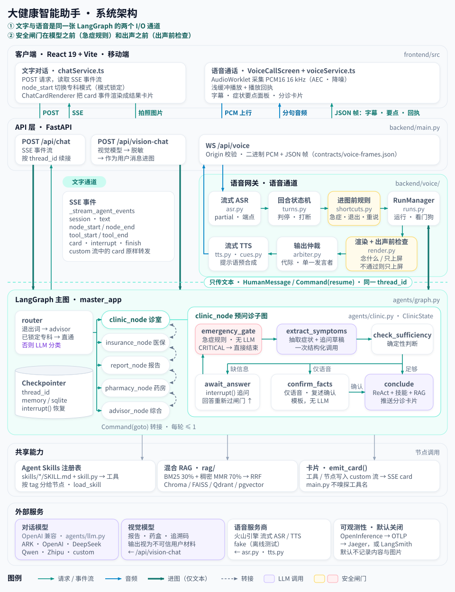</p>

项目的核心在于 **“状态路由 + Agent 转接 + 工具卡片双向绑定 + 语音即一层 I/O”**：

1. **Agent State**: `messages`、`active_agent`、`user_info`、`handoff_count`；主图编译时携带 checkpointer，会话状态按 `thread_id` 持久化在服务端，前端后续只需发送最新一条消息。
2. **Router Node**: 识别用户意图并“锁定”专科上下文。退出词为锚定匹配（整句等于退出词，或以退出词开头且紧跟标点），`我想取消明天的预约` 这类正常语句不会误退出。
3. **Agent Handoff**: 每个专科都持有指向其余四个专科的 `transfer_to_*` 工具。跑错专科时，节点返回 `Command(goto=...)`（预问诊子图用 `Command(graph=Command.PARENT, ...)`），主图在**同一轮**里把这条消息交给正确的专科；每轮最多转接一次，防止来回弹球。
4. **Clinic 子图**: 预问诊是一张拥有独立状态的编译子图——代码级急症闸门（纯规则）、结构化症状抽取与追问、确定性充分度判断、基于 `interrupt()` 的追问与恢复；语音通道额外增加复述确认与首句先播。文字还是语音由每次请求在运行配置里指定。
5. **Event Stream**: 后端透传 LangGraph 的运行状态（`session`、`node_start`、`tool_start`、`tool_end`、`card`、`interrupt`、`finish`）。卡片由产生它的 Agent 自己推送到 custom 流，API 层不再嗅探任何工具名。
6. **Voice Gateway**: `/api/voice` WebSocket 把同一套事件流翻译成"上屏什么、念什么"，自己负责判停、打断、仲裁与恢复；和图之间只传文本。
7. **Lifecycle**: 通过仓库内评估集复现问题、使用 OTLP Trace 定位节点，再以相同 case 验证迭代结果。

完整的图结构见 [docs/images/graph.mmd](docs/images/graph.mmd)，运行时细节见 [docs/langgraph-runtime.md](docs/langgraph-runtime.md)，语音设计见 [docs/voice-clinic.md](docs/voice-clinic.md)。

---

## 🚀 快速开始

本项目分为前端（React + TypeScript）和后端（Python FastAPI）两部分。

### 1. 后端服务 (Backend)

后端以 Python 编写，推荐使用 `uv` 进行环境管理。

```bash
cd backend

# 安装依赖项
uv sync

# 配置环境变量
cp .env.example .env
# 在 .env 中配置模型厂商、API Key 与模型名称，支持多家 OpenAI-compatible 服务

# 【首次运行】构建 RAG 知识库向量索引
# 默认使用本地 HuggingFace 嵌入模型，首次运行会自动下载约 90 MB 的模型文件
uv run python -m rag.ingest

# 启动服务 (运行于 8000 端口)
uv run uvicorn main:app --reload --port 8000
```

### 2. 前端服务 (Frontend)

```bash
cd frontend

# 安装依赖
npm install

# 启动开发服务器 (运行于 5173 端口)
npm run dev
```

启动完成后，在浏览器中访问 http://localhost:5173。切换设备模拟为手机视图（iPhone 13 等）以获得最佳体感。

### 3. 开启语音问诊（可选）

在 `backend/.env` 中配置语音服务商，重启后端后点击输入栏旁的 📞 即可通话：

```bash
# 火山引擎流式 ASR + 双向流式 TTS（新版控制台的单个 API Key，以 X-Api-Key 发送）
ASR_PROVIDER=volcengine
TTS_PROVIDER=volcengine
VOLC_VOICE_API_KEY=your_voice_api_key
# 可选：ASR_URL（默认 bigmodel_async，带实时字幕）、TTS_SPEAKER、ASR_END_WINDOW_MS 等，见 .env.example

# 没有语音服务账号时，可用离线替身开发界面：
# ASR_PROVIDER=fake   # 听不到声音，用通话界面里的“打字”输入
# TTS_PROVIDER=fake   # 播放静音
```

- 浏览器只在 `localhost` 或 HTTPS 下允许使用麦克风；用手机通过局域网访问时需要 HTTPS，并把页面地址加入 `EXTRA_ALLOWED_ORIGINS`。
- 想不开后端直接调界面：`node mock_voice_server.cjs` 启动一个按脚本演示整通电话的模拟服务，再用 `VITE_VOICE_WS_URL=ws://localhost:8765/api/voice npm run dev` 启动前端（都在 `frontend/` 下）。
- 用真实服务测一通完整电话并打印各阶段延迟：`uv run python test_voice_live.py e2e --calls 2`（需先启动后端）。

---

## 🛠 开发与定制

### 如何扩展 RAG 知识库？

1. 在 `backend/rag/documents/` 目录下新建 Markdown 文件，使用 `## 章节标题` 结构组织内容。
2. 重建向量索引：`uv run python -m rag.ingest --rebuild`

**切换嵌入模型或向量库**（通过环境变量）：
```bash
# 切换为 OpenAI 嵌入模型
EMBEDDING_PROVIDER=openai uv run python -m rag.ingest --rebuild

# 切换为 Qdrant 向量库（需先启动 Qdrant 服务）
VECTOR_STORE=qdrant QDRANT_URL=http://localhost:6333 uv run python -m rag.ingest --rebuild
```

详细说明参见 [docs/rag.md](docs/rag.md)。

### 如何为 Agent 添加新技能（Skill）？

技能是智能体的可插拔能力扩展，无需改动 Agent 代码即可增加：

1. 创建目录：`mkdir backend/skills/my_skill && touch backend/skills/my_skill/__init__.py`
2. 编写 `SKILL.md`（必填 `name`、`description`、`tags` frontmatter）
3. 实现 `skill.py`（继承 `BaseSkill`，定义 Pydantic I/O、`input_schema` 和 `run()` 方法）
4. 启动后注册表自动发现，无需手动注册

详细说明参见 [docs/skills.md](docs/skills.md)。

### 如何接入其他语音服务商？

语音适配器以**能力声明**描述自己（是否有中间结果、端点事件、语速控制等），网关按能力选择行为，不按厂商名分支：

1. 在 `backend/voice/providers/` 下实现 ASR / TTS 适配器，声明能力并把厂商事件映射到 `speech_start` / `partial` / `final` / `silence`。
2. 在 `voice/providers/__init__.py` 中注册环境变量解析（参考 `volcengine`，配置校验不发网络请求）。
3. 用 `test_voice_live.py loopback` 做 TTS→ASR 回环验证，再用 `e2e` 跑整通电话。

### 如何监控和评估 Agent？

```bash
# 仓库根目录：启动本地 Jaeger
docker compose -f compose.observability.yml up -d

# backend/：运行匿名回归集；DeepEval 为可选依赖
cd backend
uv run python -m evals
uv run --extra eval python -m evals --provider deepeval
```

链路开关、隐私默认值和评估样例格式参见 [docs/observability-evals.md](docs/observability-evals.md)。

### 如何增加一个新的 Agent？
1. 在 `backend/agents` 目录下新建 `your_agent.py`，并定义包含系统提示词和对应 `tools` 的 `create_react_agent` 实例。
2. 在 `backend/agents/graph.py` 中，定义一个 `your_node` 函数调用你创建的 agent。将它添加进图节点并连接来自路由器的 Edge。
3. 在 `backend/agents/router.py` 的提示词和分类器中，加入对你工具意图的理解定义。

完整清单（含转接、前端模式与评测）见 [CLAUDE.md](CLAUDE.md) 的 “Adding a New Agent”。

### 如何增加一个前端 UI 卡片？
1. 后端在产生数据的工具内部调用 `agents/streaming.py` 的 `emit_card("your_card_type", data)`；若该工具是多个 Agent 共用的通用技能，则在对应的 node 里补发（参考 `report_node`）。
2. 前端 `src/types/index.ts` 中增加 `ChatCardPayload` 联合类型。
3. 在 `frontend/src/components/chat/ChatCardRenderer.tsx` 中用 `ResultCard`、`Badge`、`Stat` 等共享组件拼出你的卡片，样式只用设计令牌（见 [frontend/docs/design-system.md](frontend/docs/design-system.md)）。

---

## 📜 规划与 Roadmap

- [x] 多 Agent 路由调度核心 (LangGraph)
- [x] 智能预问诊 & 报告科室推荐
- [x] 基于流式卡片的医保服务面板 (对齐真实业务场景)
- [x] 上下文环境隔离机制 (进入专科诊室 / 退出诊断) + Agent 之间的 `Command` 转接（swarm 式 handoff，跑错专科可同轮纠正）
- [x] RAG 知识库增强：混合检索（BM25 + 密集向量）+ 可插拔嵌入模型与向量库
- [x] 药管家 Agent（Pharmacy Agent）：药品查询、药物相互作用、OTC 推荐、附近药店
- [x] 可插拔技能系统（Agent Skills）：6 项核心技能 + 零配置自发现注册表
- [x] 多模态图片识别：拍照看报告、拍照问药与药品追溯码识别（可配置兼容模型）
- [x] Agent 生命周期基础设施：OpenTelemetry/OpenInference 链路、Jaeger 与 DeepEval 回归评估
- [x] 服务端会话状态：LangGraph Checkpointer + `thread_id`，支持 memory / sqlite 两种后端
- [x] 预问诊子图：代码级急症闸门、结构化症状抽取与 `interrupt()` 追问恢复
- [x] 卡片归属权下沉：由各 Agent 自行推送 SSE 卡片，API 层不再维护「工具名 → 卡片类型」映射
- [x] 实时语音问诊：开放麦、可打断的通话式交互，流式 ASR / TTS（火山引擎），急症接管、复述确认、断线恢复
- [x] 移动端设计规范：设计令牌 + 共享卡片组件 + 长辈模式字号体系
- [ ] 语音：真机回声消除验证（iOS Safari / Android Chrome 外放）
- [ ] 语音：语义判停模型与按用户习惯自适应等待，进一步降低截断与等待
- [ ] 语音：抢先生成（判停前起跑）与更小模型做抽取，压缩结论回合延迟
- [ ] 语音：扩展到医保、用药、报告等专科
- [ ] 语音：阿里云百炼等更多服务商适配

## 📄 开源协议

本项目采用 **MIT License**。你可以自由使用、修改和分发，但也请在你的项目中保留本项目的署名。

## 💡 鸣谢与灵感

本项目产品交互灵感来源于对**医疗大健康赛道**真实落地诉求的拆解，特别致敬业内优秀产品在“长辈模式”、“卡片富文本协同”领域的探索与实践。实时语音部分的设计参考了 Pipecat、LiveKit Agents、Kyutai unmute、TEN Framework、小智等开源实时语音项目在回合模型、打断与输出仲裁上的实践。期待与开源社区一起，将这一套生产力框架推广到更多垂直泛健康场景。
